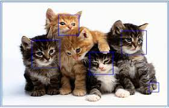
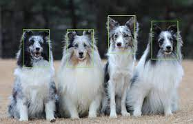

Yolov5를 이용한 Sub Project
===========================

## Yolov5를 이용한 강아지 고양이 얼굴 인식 프로그램

### 구성 요소
* 데이터를 다운받아서 압축을 해제한다.

* 데이터를 전처리 하기 위해 DataFrame을 생성한다.
* 생성한 DataFrame을 전처리 한다.
* DataFrame을 train, validation용으로 나눠서 사진과 label text를 나눈다.
* 분류한 데이터들을 학습하기 위해 Yolov5 모델을 git을 이용해 다운받는다.
* Yolov5 모델을 학습하기 위한 yaml파일을 생성한다.
* Yolov5 모델을 불러와서 학습한다.
* 학습한 모델의 가중치(best.pt)로 test를 해본다.

### 실행한 tool: Jupyter Notebook
 

Figure 1. 고양이 얼굴 인식

Figure 2. 강아지 얼굴 인식

## Yolov5를 이용한 얼굴 인식 프로그램 - 데이터 전처리

### 구성요소
* 캠을 켜서 프레임 단위로 사진을 저장한다.
* 저장한 사진을 mediapipe를 이용하여 얼굴에 bounding box가 생성되도록 한다.
* 저장한 사진의 bounding box 좌표를 yolo 형태로 저장하여 label text를 만든다.
* Data(image, label)를 train, validation용으로 분류한다. (4:1 비율)
### 실행한 tool: Jupyter Notebook

## YoloV5를 이용한 얼굴 인식 프로그램 - 모델 학습

### 구성요소
* 분류한 데이터들을 학습하기 위해 Yolov5 모델을 git을 이용해 다운받는다.
* Yolov5 모델의 학습을 위해 yaml 파일을 생성한다.
* train, validation 데이터로 학습 및 테스트를 진행한다.

### 실행한 tool: Google colaboratory

Figure 3. Mediapipe usage example